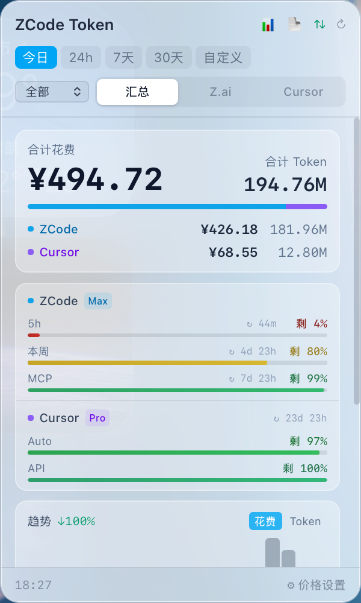
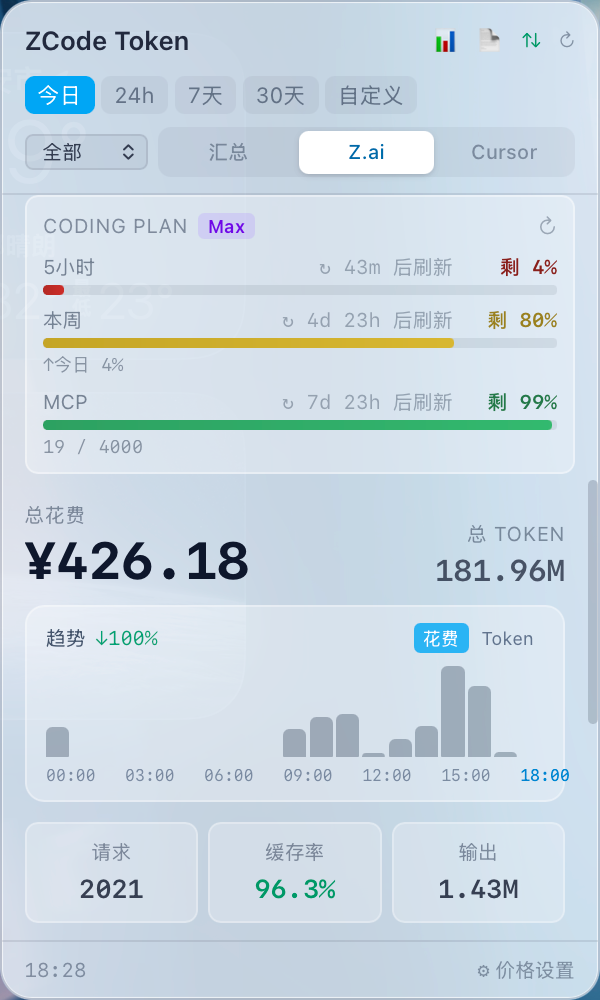
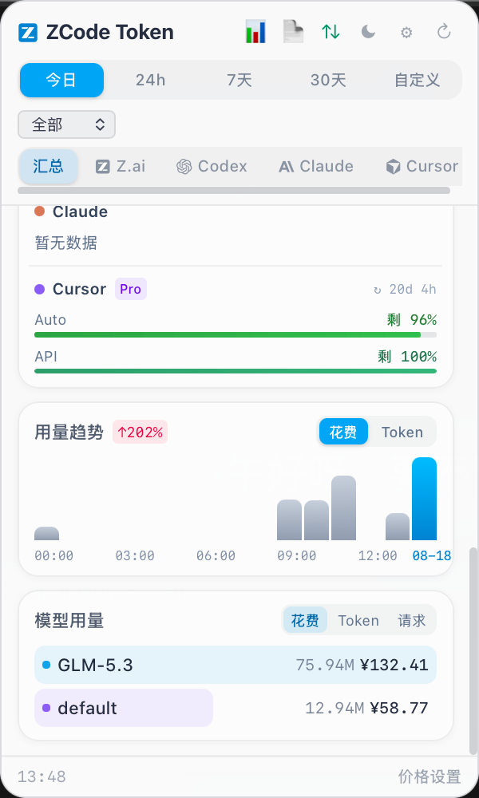
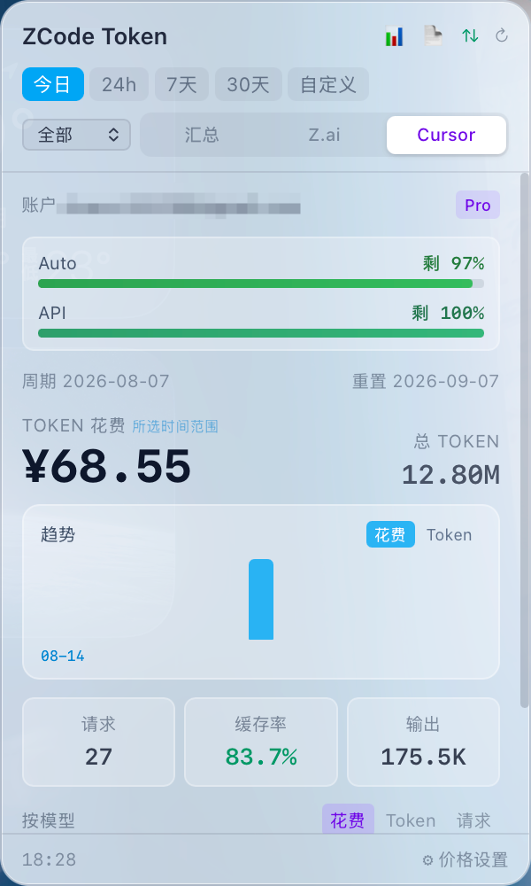
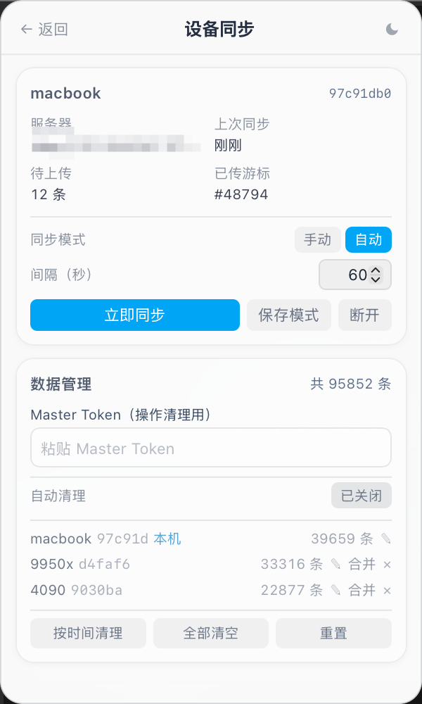

# ZBar · ZCode Token 监控

       [](https://github.com/codez-yydd/zai-floating-monitor) [](https://gitee.com/codezwx/zai-floating-monitor)

一个常驻菜单栏的轻量浮动面板，实时统计 [ZCode](https://z.ai) CLI 的 Token 用量与花费。点击菜单栏图标即可唤出毛玻璃面板查看今日 / 7 天 / 30 天的明细，并按模型分组展示。

> macOS 上的形态：菜单栏标题实时显示「今日花费 + 总 Token」，点击图标弹出贴近菜单栏的 popover 面板；Dock 不显示图标，失焦自动收起。

---

## 📍 仓库地址

- **GitHub**：[codez-yydd/zai-floating-monitor](https://github.com/codez-yydd/zai-floating-monitor)
- **Gitee**：[codezwx/zai-floating-monitor](https://gitee.com/codezwx/zai-floating-monitor)

两个仓库内容完全一致，任一仓库均可获取最新版本；GitHub / Gitee 双仓库自动降级的更新源也基于此配置。

---

## 🎬 动态壁纸效果


> 一键把动态视频壁纸注入 ZCode 桌面应用，作为对话背景——安装前自动备份，可随时还原。

---

## 📑 目录

- [📍 仓库地址](#-仓库地址)
- [🎬 动态壁纸效果](#-动态壁纸效果)
- [📸 界面截图](#-界面截图)
- [✨ 功能特性](#-功能特性)
- [🧱 技术栈](#-技术栈)
- [📁 项目结构](#-项目结构)
- [📋 环境要求](#-环境要求)
- [🚀 快速开始](#-快速开始)
- [📜 常用脚本](#-常用脚本)
- [📦 打包发布](#-打包发布)
  - [🔄 应用内自动更新（双仓库）](#-应用内自动更新双仓库)
- [⚙️ 配置说明](#️-配置说明)
  - [数据库路径](#数据库路径)
  - [价格配置](#价格配置)
  - [Coding Plan 额度监控](#coding-plan-额度监控)
  - [全局快捷键](#全局快捷键)
  - [动态壁纸](#动态壁纸)
  - [Cursor 统计](#cursor-统计)
  - [Kimi 统计](#kimi-统计)
  - [周额度对比与报表](#周额度对比与报表)
  - [多设备同步](#多设备同步)
- [🧮 计费规则](#-计费规则)
- [🔒 数据安全](#-数据安全)
- [📄 License](#-license)

---

## 📸 界面截图

| 预览 | 说明 |
|:---:|:---|
|  | **汇总视图** — 多服务合计花费 / Token 与订阅额度 |
|  | **Z.ai 视图** — Coding Plan 5 小时 / 每周 / MCP 额度 |
|  | **趋势与模型排行** — 按时段用量趋势与模型排行 |
|  | **Cursor 视图** — Pro / Auto / API 额度与用量统计 |
|  | **价格设置** — 美元单价、汇率折算与全局快捷键 |
|  | **设备同步** — 多设备增量同步与数据管理 |

---

## ✨ 功能特性

**🖥 核心体验**

- **实时菜单栏标题** — 常驻 macOS 顶部菜单栏，每 30 秒刷新，显示今日自然日的总花费（`¥xx.xx`，美元模式下为 `$xx.xx`）与总 Token（如 `3.7M`）。
- **浮动统计面板** — 点击托盘图标唤出，支持 **今日 / 24h / 7天 / 30天 / 自定义** 时间范围切换。
- **原生体验** — macOS 使用 `popover` 毛玻璃材质 + 透明窗口；Windows/Linux 面板贴近任务栏展开。
- **自动刷新** — 面板数据每 30 秒自动拉取一次。
- **⌨️ 全局快捷键** — 默认 `alt+shift+z` 唤起 / 隐藏面板，可在设置中自定义或停用。
- **🎨 动态壁纸** — 一键把动态视频壁纸注入 ZCode 桌面应用，作为对话背景；安装前自动备份原版、可随时还原。ZCode 升级后壁纸会失效，需重新安装；macOS 上注入后 ZCode 内置更新将不可用（还原也无法恢复），需前往官网重新下载。

**🤖 多服务用量统计**

- **Coding Plan 额度监控** — 订阅用户可在面板顶部查看 **5 小时窗口**、**每周额度**与 **MCP 月度额度**的用量进度条，颜色随用量警示（绿→琥珀→红），并显示下次重置倒计时。凭证与接口端点**自动读取**本机 ZCode 客户端登录态（`~/.zcode/v2/config.json`），零配置。
- **🖥 Cursor 用量统计** — 自动读取本机 Cursor 应用的登录凭据，统计 Pro / Auto / API 套餐额度与 Token 花费明细，美元花费按汇率折算后并入汇总视图。
- **🟢 Codex 用量统计** — 解析本机 `~/.codex/sessions` 会话记录统计 Token 用量与花费；ChatGPT 订阅登录的机器上还可实时拉取 **5 小时 / 每周**额度进度条（API 中转模式自动隐藏额度块）。
- **🟠 Claude 用量统计** — 解析本机 `~/.claude/projects` 会话记录统计 Token 用量与花费（含子代理会话，按 message 去重防重复计数）；claude.ai 订阅登录的机器上实时拉取 **5 小时会话 / 每周**额度（第三方中转模式自动隐藏额度块）。
- **🌙 Kimi 用量统计** — 解析本机 `~/.kimi-code/sessions` 会话记录（`wire.jsonl`）统计 Token 用量、花费与 **Token 输出速度**；已登录 Kimi Code CLI 的机器上自动探测本地凭据（OAuth 过期时后台自动续期，无需配置），实时拉取订阅额度：**5 小时滚动窗口 / 周期额度**进度条与重置倒计时、加油包余额、官方会员档位名；也可在设置中手动配置 Kimi API Key。
- **🧭 多服务汇总视图** — 「汇总 / Z.ai / Codex / Claude / Cursor / Kimi」标签切换：多服务合计花费与 Token、订阅额度卡片、分时趋势图与模型排行。
- **⚡ 速度与首字延迟** — 基于调用耗时统计**平均输出速度（tok/s）**与**首字延迟（TTFT）**，含噪声过滤口径（整块下发识别、计时异常剔除）。ZCode / Claude 面板可用；Kimi 面板可用 TPS（由请求耗时推算的输出速度口径、无 TTFT，首字延迟与 Claude 一样隐藏）；Codex / Cursor 数据源无耗时字段，自动隐藏。
- **🎯 当前模型** — 各 Agent 面板显示「当前模型」（口径：最近一次调用使用的模型 + 相对时间），汇总页各服务分组同步展示。

**💰 价格与计费**

- **价格配置** — 为每个模型设置「输入 / 输出 / 缓存读」三项**美元**单价（每百万 Token），配置持久化到 `~/.zbar/pricing.json`，人民币花费按当前汇率自动折算；支持一键「检查价格更新」，与内置参考表离线对比（定价数据源自 [cc-switch](https://github.com/farion1231/cc-switch) 开源项目，不联网）。
- **缓存感知计费** — `input_tokens` 已包含缓存读部分，计费时缓存读按缓存价单独计算，非缓存输入按输入价计算，避免重复计费。
- **💱 汇率自动更新** — USD→CNY 汇率默认每日自动联网更新（也可改为手动填写），用于各服务的美元花费折算与人民币参考价换算。

**📊 数据与报表**

- **Token 明细** — 输入、输出、缓存读、缓存写、推理 Token 分类统计，并按占比可视化。
- **按模型分组** — 列出每个模型的请求数、Token、花费；未配置价格的模型会标记 ⚠ 提示。
- **📈 周额度对比** — 基于本地额度快照（90 天滚动保留）对比每个重置周期的额度用量，支持跨设备合并。
- **📝 日报 / 周报** — 一键生成 Markdown 日报（今日）/ 周报（近 7 天）并保存到本地。

**🔄 同步与更新**

- **🔄 多设备同步** — 自托管同步服务（`server/`），让公司 / 家里等多台电脑汇总查看全量用量。明细增量上传 + `(device, rowid)` 去重，支持**设备筛选**（全部 / 本机 / 指定设备）和**数据清理**（按设备 / 按时间 / 全清 + 可配置自动定时清理）。详见 [server/README.md](./server/README.md)。
- **⬆️ 应用内自动更新** — 设置 →「关于与更新」检查 / 下载 / 静默安装新版本，更新源 **GitHub / Gitee 双仓库自动降级**，更新包签名校验；启动静默检查，有新版时设置入口亮红点。

---

## 🧱 技术栈

| 层 | 技术 |
| --- | --- |
| 桌面框架 | [Tauri 2](https://tauri.app/)（Rust 后端 + WebView 前端） |
| 前端 | React 19 + TypeScript + Vite 7 |
| 样式 | Tailwind CSS v4（`@tailwindcss/vite`） |
| 数据库 | SQLite（`rusqlite`，只读访问 ZCode 数据库） |
| macOS 原生 | `objc2` / `objc2-app-kit`（毛玻璃透明度调优、Accessory 模式隐藏 Dock） |

---

## 📁 项目结构

```
zai-floating-monitor/
├── src/                      # 前端（React）
│   ├── App.tsx               # 视图路由：统计 / 价格设置 / 设备同步 / 周额度对比 / 报表
│   ├── StatsPanel.tsx        # 统计面板（含设备筛选器 + 本地/远端数据合并）
│   ├── SummaryTab.tsx        # 汇总视图（多服务合计 / 趋势 / 模型排行）
│   ├── CursorPanel.tsx       # Cursor 视图（额度 + 用量统计）
│   ├── AgentUsagePanel.tsx   # 单 CLI Agent 通用用量面板（Codex / Claude 共用）
│   ├── CodexPanel.tsx        # Codex 视图（AgentUsagePanel 品牌皮肤）
│   ├── ClaudePanel.tsx       # Claude 视图（AgentUsagePanel 品牌皮肤）
│   ├── KimiPanel.tsx         # Kimi 视图（AgentUsagePanel 品牌皮肤）
│   ├── PricingPanel.tsx      # 价格配置面板
│   ├── SettingsPanel.tsx     # 设置页（透明度 / 语言 / 开机自启 / 数据来源 / 汇率 / 快捷键）
│   ├── QuotaPanel.tsx        # Coding Plan 额度监控
│   ├── ComparePanel.tsx      # 周额度对比
│   ├── ReportPanel.tsx       # 日报 / 周报（Markdown 导出）
│   ├── SyncPanel.tsx         # 设备同步设置面板（注册 / 数据管理）
│   ├── RangePicker.tsx       # 时间范围选择器
│   ├── api.ts                # invoke 封装（调用 Rust 命令）
│   ├── types.ts              # 与 Rust 结构一一对应的 TS 类型
│   ├── format.ts             # Token / 金额 / 百分比格式化
│   └── main.tsx              # 入口
├── src-tauri/                # Rust 后端（客户端）
│   ├── src/
│   │   ├── lib.rs            # 应用入口、托盘、面板逻辑、Tauri 命令
│   │   ├── db.rs             # SQLite 只读查询（统计 / 模型列表 / 增量查询）
│   │   ├── pricing.rs        # 价格配置读写 + 内置参考表差异检查
│   │   ├── quota.rs          # Coding Plan 额度查询（自动读取 ZCode 客户端凭证；5 小时 / 每周 / MCP）
│   │   ├── quota_history.rs  # 额度快照历史（JSONL，90 天滚动保留）
│   │   ├── cursor.rs         # Cursor 用量统计（自动凭据 / Cookie / API）
│   │   ├── codex.rs          # Codex 用量统计（sessions 解析 + 实时订阅额度）
│   │   ├── claude.rs         # Claude 用量统计（projects 解析 + OAuth 实时额度）
│   │   ├── kimi.rs           # Kimi Code 用量统计（wire.jsonl 解析 + OAuth 内存续期额度）
│   │   ├── shortcut.rs       # 全局快捷键配置
│   │   ├── sync.rs           # 多设备同步（配置 / 增量上传 / 远端查询 / 清理）
│   │   └── main.rs
│   ├── capabilities/         # Tauri 权限配置
│   └── tauri.conf.json       # 窗口 / 打包配置
├── server/                   # 自托管同步服务（Python + Flask）
│   ├── app.py                # Flask 应用 + 所有接口
│   ├── db.py                 # SQLite 操作（自动建库建表）
│   ├── auth.py               # 鉴权（master token / device token）
│   ├── config.py             # 配置（端口 / 数据目录）
│   └── README.md             # 部署文档
├── index.html
└── vite.config.ts
```

---

## 📋 环境要求

1. **Node.js** ≥ 18（推荐 20+）及 npm
2. **Rust**（stable 工具链）—— 通过 [rustup](https://rustup.rs/) 安装
3. Tauri 2 的系统依赖：
   - **macOS**：Xcode Command Line Tools（`xcode-select --install`）
   - **Windows**：Microsoft Edge WebView2 + MSVC 构建工具
   - **Linux**：`webkit2gtk`、`libayatana-appindicator` 等（详见 [Tauri 文档](https://v2.tauri.app/start/prerequisites/)）

4. **ZCode CLI** 已安装并已产生使用记录（数据库位于 `~/.zcode/cli/db/db.sqlite`）

---

## 🚀 快速开始

```bash
# 1. 安装依赖
npm install

# 2. 开发模式（同时启动 Vite 与 Tauri 窗口，热重载）
npm run tauri dev
```

开发服务器运行在 `http://localhost:1420`，Tauri 会加载它并打开原生窗口。

---

## 📜 常用脚本

| 命令 | 说明 |
| --- | --- |
| `npm run dev` | 仅启动 Vite 前端开发服务器（浏览器调试，无 Tauri 原生能力） |
| `npm run tauri dev` | **开发模式**：启动前端 + Tauri 原生窗口，支持热重载 |
| `npm run build` | 类型检查 + 构建前端产物到 `dist/` |
| `npm run tauri build` | **打包**：生成可分发的安装包（`.app` / `.dmg` / `.msi` / `.AppImage`） |
| `npm run preview` | 本地预览已构建的前端产物 |

---

## 📦 打包发布

```bash
# 生成当前平台的安装包，输出在 src-tauri/target/release/bundle/
npm run tauri build
```

- **macOS**：`ZBar.app`、`.dmg`
- **Windows**：`.msi`、`NSIS .exe`
- **Linux**：`.deb`、`.AppImage`、`.rpm`

如需指定目标：

```bash
npm run tauri build -- --target aarch64-apple-darwin
```

### 🔄 应用内自动更新（双仓库）

应用内置自动更新：设置 →「关于与更新」检查新版本、下载并静默安装；启动时会静默检查一次，有新版本时设置入口按钮显示红点。更新源为 **GitHub / Gitee 双 endpoint**，依次自动降级，任一仓库可达即可完成更新。

**首次发版准备**（一次性）：

1. 生成更新签名密钥对（私钥丢失将**永远无法**再推送更新，务必备份到安全位置）：

   ```bash
   npx tauri signer generate -w ~/.tauri/zbar-updater.key
   ```

2. 公钥（`~/.tauri/zbar-updater.key.pub` 内容）写入 `src-tauri/tauri.conf.json` 的 `plugins.updater.pubkey`（本项目已配置）。
3. 在仓库 **Settings → Secrets and variables → Actions** 添加 Secrets：
   - `TAURI_SIGNING_PRIVATE_KEY`：私钥文件 `~/.tauri/zbar-updater.key` 的**完整内容**
   - `GITEE_TOKEN`（可选）：Gitee 私人令牌（设置 → 私人令牌，勾选 projects）；缺失时自动跳过 Gitee 更新源，仅发布 GitHub 源

**发布新版本**（GitHub Actions 云端构建双平台，本地无需任何工具链）：

```bash
# 版本号已在 package.json / src-tauri/tauri.conf.json / src-tauri/Cargo.toml 三处同步并提交后：
git tag v0.2.0
git push origin v0.2.0
```

流水线（`.github/workflows/release.yml`）自动完成：三平台并行签名构建（Windows x64 / macOS Apple Silicon / macOS Intel，产物带 `.sig`）→ 生成两份 `latest.json`（安装包下载地址分别指向 GitHub / Gitee 各自仓库）→ 创建 GitHub Release（tag `v{版本}`，自动标记 latest）→ 重建 Gitee 固定 tag `latest` 的 Release（作为更新元数据源）。Gitee 源上传失败或未配置 token 时，在 Actions 页面重跑 `release` job 即可单独补发。

> macOS 安装包未做开发者证书签名与公证，首次打开需右键安装包 →「打开」，或在系统设置中允许。

---

## ⚙️ 配置说明

### 数据库路径

ZBar 以 **只读** 方式访问 ZCode 的 SQLite 数据库，不会干扰 ZCode 的写入。

定位优先级：

1. 环境变量 **`ZBAR_DB`**（指向自定义的 `.sqlite` 文件）
2. 默认路径：**`~/.zcode/cli/db/db.sqlite`**

### 价格配置

通过面板内的「价格设置」可视化编辑，或直接编辑文件：

**路径：`~/.zbar/pricing.json`**（只存美元价；人民币花费按当前汇率自动折算，无需单独维护）

```json
{
  "usd": {
    "glm-4.6": { "input": 0.6, "output": 2.2, "cache_read": 0.11 }
  }
}
```

- 单位：**每百万 Token** 的美元价格
- 三个字段：`input`（非缓存输入）、`output`（输出）、`cache_read`（缓存读）
- 只需填写需要计费的模型；未填的模型在面板中显示 `—` 并标记 ⚠
- 汇率在「设置 → 汇率」中统一配置（每日自动更新），人民币花费 = 美元花费 × 汇率

面板内支持一键「检查价格更新」：与内置参考表离线对比（不联网），内置表定价数据源自 [cc-switch](https://github.com/farion1231/cc-switch) 开源项目的成本定价模块（另补充了 Z.ai 特有模型），确认差异后合并进本地价格表；有新模型发布时在 `public/pricing-defaults.json` 中补充发布即可。

### Coding Plan 额度监控

订阅 GLM Coding Plan 的用户可在统计面板顶部查看 5 小时窗口、每周额度与 MCP 月度额度的实时用量。

**零配置**：凭证自动只读本机 ZCode 客户端的登录态——`~/.zcode/v2/config.json` 中内置 Coding Plan provider 的 apiKey（**只读，绝不写回**），接口端点按该 provider 的 baseURL 自动推断（`open.bigmodel.cn` / `api.z.ai`）。前提是本机 ZCode 客户端已登录 Coding Plan 订阅；未登录时面板显示登录引导，不影响其他功能。

额度数据通过 `GET /api/monitor/usage/quota/limit` 接口实时获取，每 30 秒自动刷新。

### 全局快捷键

默认 `alt+shift+z` 唤起 / 隐藏面板，可在「设置 → 全局快捷键」中修改或停用，配置持久化到 `~/.zbar/shortcut.json`：

```json
{
  "enabled": true,
  "accelerator": "alt+shift+z"
}
```

### 动态壁纸

点击工具栏的 🎨 按钮即可打开「动态壁纸」，把动态视频注入 ZCode 桌面应用作为对话背景。安装前会自动备份原版资源，随时可一键还原。

注意事项：

- ZCode 升级后壁纸会失效，需要重新安装一次。
- macOS 上注入后，ZCode 自带的内置更新将不可用（还原也无法恢复），升级 ZCode 请前往官网重新下载。

### Cursor 统计

自动读取本机 Cursor 应用的本地登录凭据（需已安装并登录 Cursor），无需配置。

**汇率**（设置 → 汇率）：USD→CNY 默认每日自动联网更新，也可取消勾选后手动填写；各服务的美元花费按此汇率折算成人民币。配置保存在 `~/.zbar/cursor.json`（仅存于本机）。

### Kimi 统计

解析本机 `~/.kimi-code/sessions` 会话记录（`wire.jsonl`）统计用量与速度，前置条件是已安装并登录 Kimi Code CLI 且产生过本地会话；订阅额度接口通过本地凭据自动拉取（OAuth 过期时后台自动续期，无需配置），也可在设置中手动配置 Kimi API Key。

### 周额度对比与报表

- **周额度对比** — 以额度快照历史为数据源（`~/.zbar/quota_history.jsonl`，append-only，90 天滚动保留），按重置周期对比额度用量，支持跨设备合并。
- **日报 / 周报** — 面板内一键生成 Markdown 报表（日报 = 今日，周报 = 近 7 天）并保存为 `.md` 文件。

### 多设备同步

多台电脑（公司 / 家里）汇总查看全量用量。通过自托管同步服务实现，数据存在你自己的服务器上。

**部署服务端**（Python + Flask，装个依赖直接跑）：

```bash
cd server
pip3 install -r requirements.txt   # 只需 Flask
python3 app.py                      # 启动后日志会打印 Master Token
```

详见 [server/README.md](./server/README.md)。

**客户端配置**：点击面板顶部 **⇅** 图标进入「设备同步」设置，填写服务器地址 + Master Token + 设备名称（如 `work` / `home`），点「连接并注册」。

注册成功后：

- **设备筛选器** — 统计面板顶部出现设备下拉，可选「全部（汇总）」「本机」或指定设备。
- **同步模式** — 手动（点「立即同步」）或自动（按间隔自动上传）。
- **数据管理** — 按设备 / 按时间 / 全部清空，可配置服务端自动定时清理。

配置保存在 **`~/.zbar/sync.json`**（Master Token 不持久化，注册后即丢弃）：

```json
{
  "enabled": true,
  "mode": "auto",
  "interval_seconds": 60,
  "server_url": "http://192.168.1.100:3838",
  "device_id": "uuid-xxx",
  "device_name": "work",
  "device_token": "...",
  "last_uploaded_rowid": 12345
}
```

**同步原理**：ZCode 的用量记录是只增不删的，客户端按 `rowid` 增量上传，服务端用 `(device_id, local_rowid)` 去重。查询时本机数据查本地、其他设备数据查远端，合并展示，避免重复计算。

---

## 🧮 计费规则

为避免重复计费，输入类 Token 拆分计算：

```
非缓存输入 = input_tokens - cache_read_tokens

花费 = 非缓存输入 × input价
     + output_tokens   × output价
     + cache_read      × cache_read价
        （单位：每百万 Token，结果以货币计）
```

面板与菜单栏标题共用同一套 Rust 计算逻辑，保证数字一致。

---

## 🔒 数据安全

- 数据库连接使用 `SQLITE_OPEN_READ_ONLY`，**只读不写**，绝不影响 ZCode 数据。
- 价格配置仅保存在用户本地 `~/.zbar/` 目录，不上传任何数据。
- **账号切换**会把 ZCode 登录态快照保存在 `~/.zbar/accounts/`（目录权限 700、文件 600）用于一键切换，**仅存本机、不参与多设备同步**；本应用为非官方社区工具，与智谱 AI 官方无关。
- **多设备同步**为可选功能，默认关闭。启用后仅同步模型名、Token 数量、时间戳，**不含代码和对话内容**。服务端自托管，数据存在你自己的服务器上。
- 面板失焦自动隐藏，窗口常驻不销毁，点击托盘即可重新唤出。

---

## 📄 License

[MIT License](./LICENSE) · Copyright © 2026 小轩
